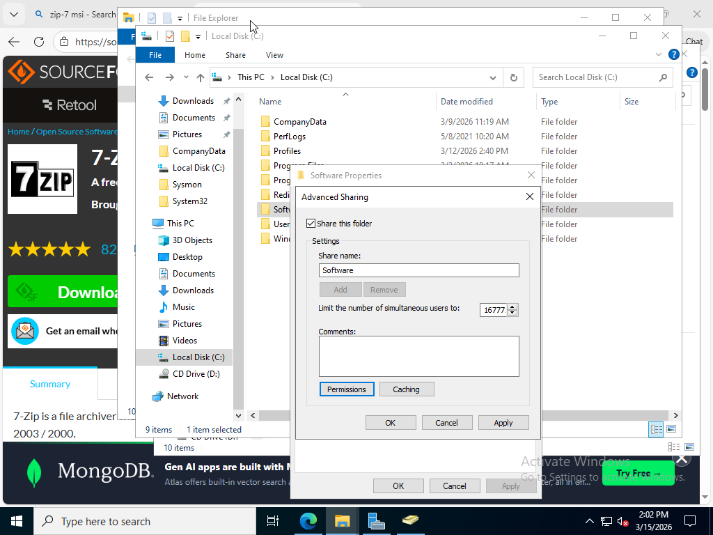
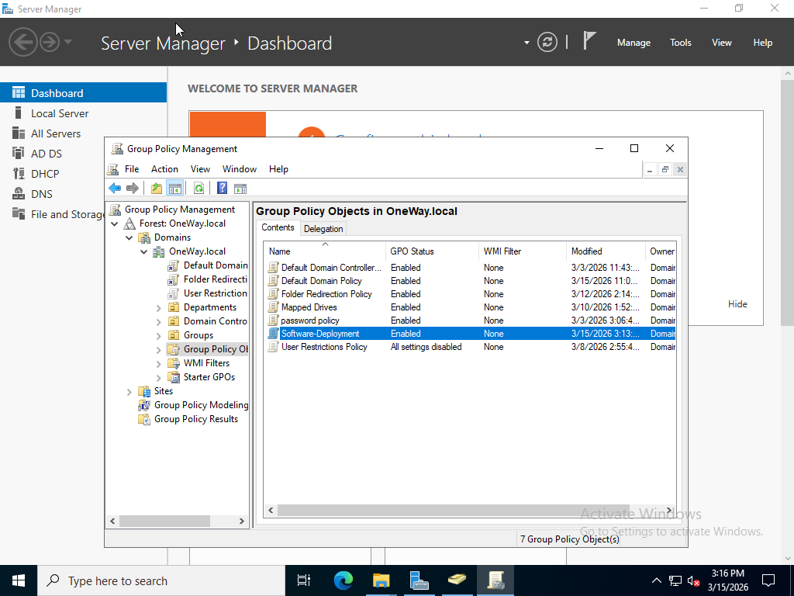
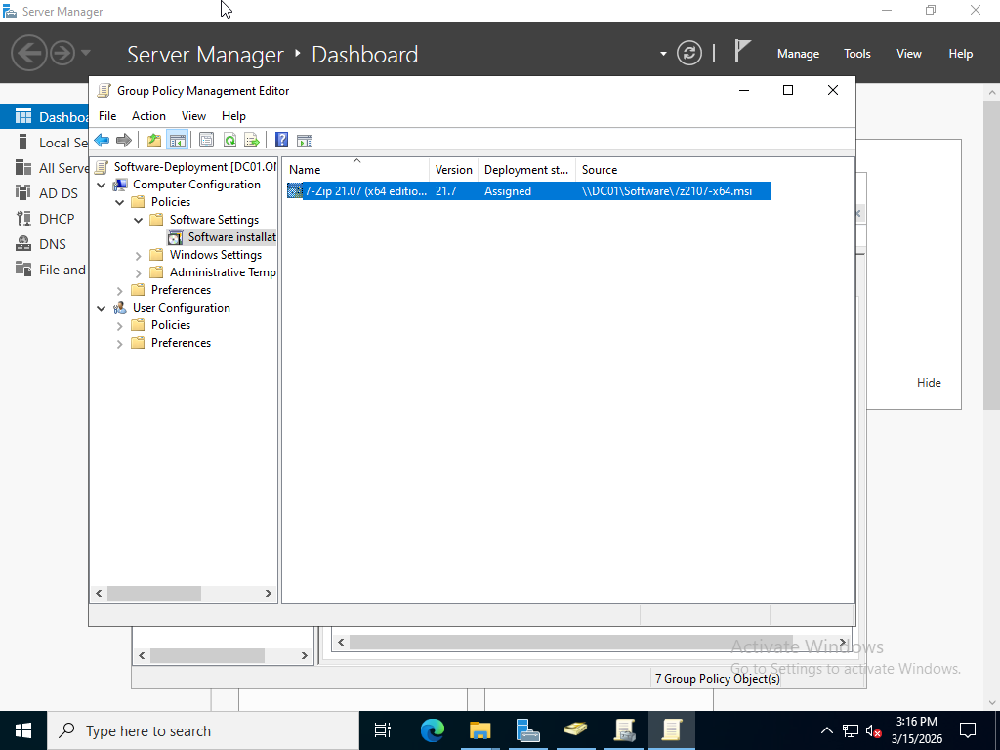
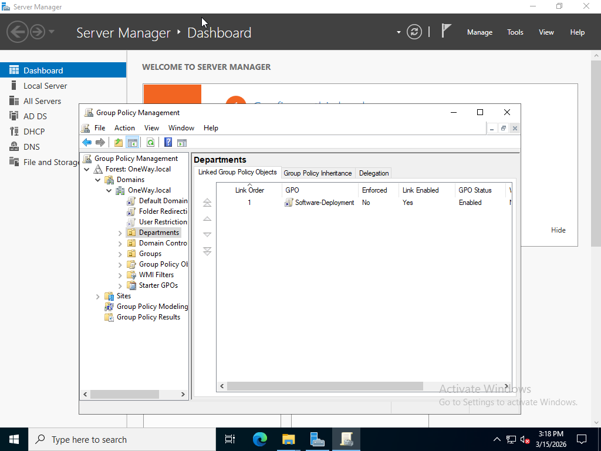

# Active Directory Software Deployment Lab

## Overview

This lab demonstrates how to deploy software across domain computers using Group Policy in an Active Directory environment.

Software deployment via Group Policy allows administrators to install applications automatically on multiple machines without manual intervention.

---

## Lab Environment

Domain Controller: DC01  
Domain: OneWay.local  
Client Machine: Windows 10  

Technologies Used:

- Windows Server 2022
- Active Directory
- Group Policy Management

---

## Lab Tasks

### 1. Prepare Software Package

The application used in this lab:

7-Zip (MSI version)

The installer was placed on the domain controller in a shared folder.

Example path:

\\DC01\Software\7zip.msi

---

### 2. Create Shared Folder

A shared folder named:

Software

was created and configured with appropriate permissions to allow domain computers to access the installation files.

---

### 3. Create Group Policy Object

A new GPO named:

Software-Deployment

was created using Group Policy Management.

---

### 4. Configure Software Installation

The software package was added using:

Computer Configuration  
Policies  
Software Settings  
Software Installation  

The deployment method selected:

Assigned

---

### 5. Link GPO to OU

The GPO was linked to:

Computers OU

This ensures the software is deployed to domain-joined machines.

---

### 6. Apply Policy

On the client machine:

gpupdate /force

Then the system was restarted.

---

## Testing

After restarting the client machine:

- The software was automatically installed.
- The application appeared in the Start Menu.

---

## Screenshots

### Shared Folder Configuration

### GPO Created

### Software Package Added

### GPO Linked to OU

## Result

Software deployment was successfully completed using Group Policy.

This lab demonstrates how administrators can centrally manage application installation across multiple domain computers efficiently.
